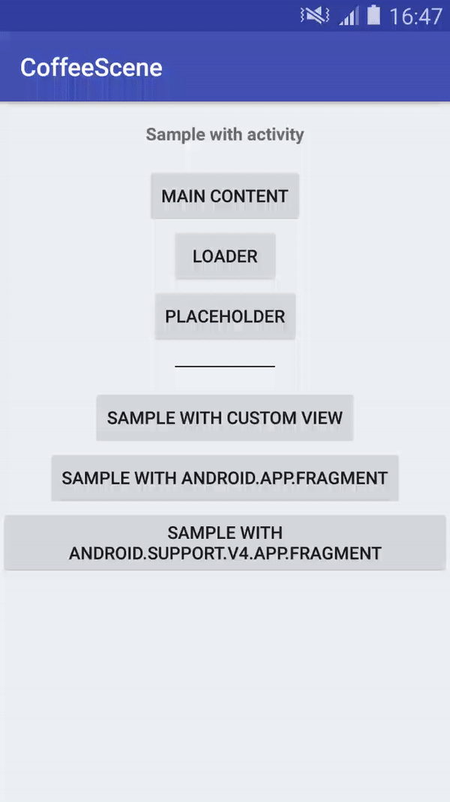

# CoffeeScene-Android

A simple scene manager for Android.<br>
CoffeeScene allows to switch the current scene of an Activity, ViewGroup and Fragment (v4 supported).<br>
This library can be usefull if you want to switch from a spinner loader to your main content or a placeholder for example.

Sample app
=======
The sample app is available in this repository under **sample/**.<br>
You can also try it on Google Play : https://play.google.com/store/apps/details?id=com.geronimostudios.sample.coffeescene

Gradle
=======
Include the dependency [Download (.aar)](https://bintray.com/geronimostudios/geronimostudios/download_file?file_path=com%2Fgeronimostudios%2Fcoffeescene%2Fcoffeescene%2F1.0.1%2Fcoffeescene-1.0.1.aar) :

```groovy
dependencies {
    implementation 'com.geronimostudios.coffeescene:coffeescene:1.0.1'
}
```

Example
=======


How to use with a SceneCreator
==========
You can use the **SceneCreator** with an activity, viewgroup or fragment.<br>
You have to inflate your viewgroup, fragment or call _setContentView(...)_ in your activity before using the **SceneCreator**.<br>
The SceneCreator is useful if the anchors of your scenes aren't at the root of your layout.<br>

```java
public class SampleNoAnnotationsActivity extends AppCompatActivity implements View.OnClickListener {

    @Override
    protected void onCreate(Bundle savedInstanceState) {
        super.onCreate(savedInstanceState);
        setContentView(R.layout.activity_no_annotations_sample);
        
        SceneManager.create(
                SceneCreator.with(this)
                        .add(Scene.MAIN, R.id.activity_no_annotations_sample_main_content)
                        .add(Scene.MAIN, R.id.activity_no_annotations_sample_main_content_another_view) // you can add many layouts to the same scene id.
                        .add(Scene.SPINNER, R.id.activity_no_annotations_sample_loader)
                        .add(Scene.PLACEHOLDER, R.id.activity_no_annotations_sample_placeholder)
                        .add(EMPTY_RECYCLER_PLACEHOLDER, R.id.activity_no_annotations_sample_empty_placeholder)
                        .listener(this)
                        .animation(this)
                        .first(Scene.SPINNER)
        );
    }
...
}
```
With a SceneCreator the scenes are registered by calling **.add** with an unique identifier and the id of the view/viewgroup that holds the scene.

How to use with annotations only
==========
You have to declare your **scenes** in your activity, viewgroup or fragment.
Each scene requires an unique identifier (sceneId) and a valid layout resource.

```java
@CoffeeScene({
        @Scene(scene = Scene.MAIN, layout = R.layout.sample_activity_main),
        @Scene(scene = Scene.MAIN, layout = R.layout.sample_activity_main_second_anchor), // you can add many layouts to the same scene id.
        @Scene(scene = Scene.SPINNER, layout = R.layout.loader),
        @Scene(scene = Scene.PLACEHOLDER, layout = R.layout.placeholder)
})
public class MainActivity extends Activity {

    @Override
    protected void onCreate(Bundle savedInstanceState) {
      super.onCreate(savedInstanceState);
        SceneManager.create(this);
        
        ...
    }
    ...
}
```

The class **Scene** provides a few scene's identifiers : _Scene.MAIN, Scene.SPINNER and Scene.PLACEHOLDER_.<br>
You are free to use it or not, but be sure that each identifier is unique.

**Activities**: Just call _SceneManager.create(this);_. You don't need to call setContentView();<br>
**ViewGroup**: Just call _SceneManager.create(this);_. All scenes will be automatically created and added to your viewgroup.<br>
**Fragments**: With fragments _SceneManager.create(this)_ will returns the view that must be returned by **onCreateView**<br>

Change the current scene
------------------------
You can easily change the current scene with **SceneManager.scene(this, int sceneId);**.<br>
-The first parameter must be the same object that was passed to _SceneManager.create(this);_.<br>
-The second parameter is the unique identifier of the scene.

```java
...
public class SampleActivity extends AppCompatActivity implements View.OnClickListener {
    ...
    
    @Override
    public void onClick(View v) {
        switch (v.getId()) {
            case R.id.sample_switch_to_progress:
                SceneManager.scene(this, Scene.SPINNER); // Change the current scene
                break;
            case R.id.sample_switch_to_placeholder:
                SceneManager.scene(this, Scene.PLACEHOLDER); // Change the current scene
                break;
             ...
        }
    }
}
```

Release your scenes
------------------------
Don't forget to release your scenes.

```java
...
public class SampleActivity extends AppCompatActivity implements View.OnClickListener {
    ...
    
    @Override
    protected void onDestroy() {
        super.onDestroy();
        SceneManager.release(this);
    }
    ...
}
```


Full example
------------------------
```java
@CoffeeScene(
        value = {
                @Scene(scene = Scene.MAIN, layout = R.layout.sample_activity_main),
                @Scene(scene = Scene.SPINNER, layout = R.layout.loader),
                @Scene(scene = Scene.PLACEHOLDER, layout = R.layout.placeholder)
        },
        first = Scene.MAIN
)
public class SampleActivity extends AppCompatActivity implements View.OnClickListener {

    @Override
    protected void onCreate(Bundle savedInstanceState) {
        super.onCreate(savedInstanceState);
        SceneManager.create(this); // Setup scenes

        findViewById(R.id.sample_switch_to_main).setOnClickListener(this);
        findViewById(R.id.sample_switch_to_progress).setOnClickListener(this);
        findViewById(R.id.sample_switch_to_placeholder).setOnClickListener(this);
    }

    @Override
    public void onClick(View v) {
        switch (v.getId()) {
            case R.id.sample_switch_to_main:
                SceneManager.scene(this, Scene.MAIN); // Change the current scene
                break;
            case R.id.sample_switch_to_progress:
                SceneManager.scene(this, Scene.SPINNER); // Change the current scene
                break;
            case R.id.sample_switch_to_placeholder:
                SceneManager.scene(this, Scene.PLACEHOLDER); // Change the current scene
                break;
            ...
        }
    }
    
    @Override
    protected void onDestroy() {
        super.onDestroy();
        SceneManager.release(this);
    }
}
```

License
======
```
Copyright (C) 2018 Geronimo

Licensed under the Apache License, Version 2.0 (the "License");
you may not use this file except in compliance with the License.
You may obtain a copy of the License at

    http://www.apache.org/licenses/LICENSE-2.0

Unless required by applicable law or agreed to in writing, software
distributed under the License is distributed on an "AS IS" BASIS,
WITHOUT WARRANTIES OR CONDITIONS OF ANY KIND, either express or implied.
See the License for the specific language governing permissions and
limitations under the License.
```
